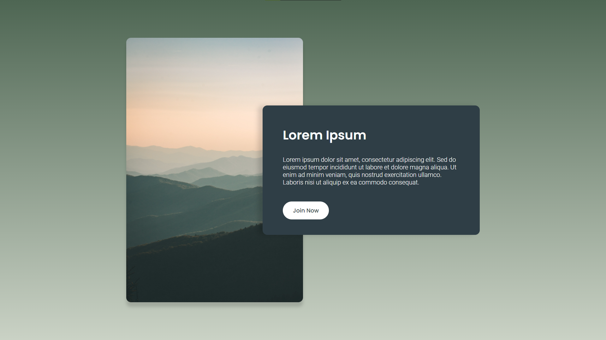

# Personal Project - Call To Action

## 📖 About

The first ever web page that I coded after MY own design, made in the popular web designing tool `Figma`.

## 🖼️ [Live Preview Link](https://zascuofficial-cta.netlify.app/ "The preview link")

## 💻 Technologies Used

